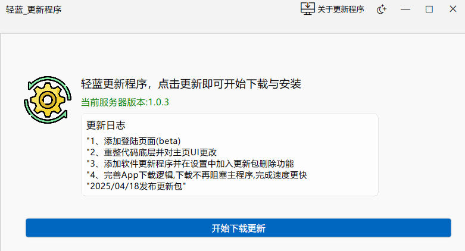

# 轻蓝(原笙箫启动器)与轻蓝更新程序

轻蓝是一个将自己开发过的软件集成在一起的软件，支持下载、安装、卸载(后续将支持源代码下载)

轻蓝更新程序，故名思义就是其更新下载与安装的软件。

这两个App界面均采用简洁的Fluent UI，控件效果及其UI采用的是一个Elawidgettools将Fluent UI Qt C++化的一个项目

## 展示图片

|                           1                            |                           2                           |
| :----------------------------------------------------: | :---------------------------------------------------: |
|  |  |
|  |  |
|  | |

## 编译

1. 目录结构

   ```
   .
   └── CLion_ShengXiaoBooter/
       ├── .idea
       ├── build
       ├── example
           └── CURL
           └── ExamplePage
           └── Resource
       ├── src
           └── DeveloperComponents
           └── include
           └── private
   .
   └── CLion_ShengXiaoBooterUpData/
       ├── .idea
       ├── build
       ├── example
           └── CURL
           └── ExamplePage
           └── Resource
       ├── src
           └── DeveloperComponents
           └── include
           └── private
           
   example中存放一些功能与页面cpp源文件
   src中存放开源软件Elawidgettools的UI与控件的cpp源文件
   ```

   CLion_ShengXiaoBooter与CLion_ShengXiaoBooterUpData采用基本相同的目录结构因此这里仅仅上传CLion_ShengXiaoBooterUpData的.idea build example文件夹，src使用CLion_ShengXiaoBooter的即可

2. CMark与C++与QT6.5组合，使用CLion编译器进行编写

## 服务端(QingLan_Server)

为方便使用，通过ini文件进行传参 使用IIS服务器

## 注意

1.编译时注意example中的cmake文件CURL库引用是用的绝对路径，编译时改成你当前路径
  和项目总CmakeLists中的miniGW路径也是采用绝对路径

2.本项目使用了mysql数据库，具体qt中引入mysql自行网上查找

3.本开源项目使用GPLv3开源协议，再次开发请依次保留声明

## 引用的开源软件

1.Elawidgettools https://github.com/Liniyous/ElaWidgetTools

